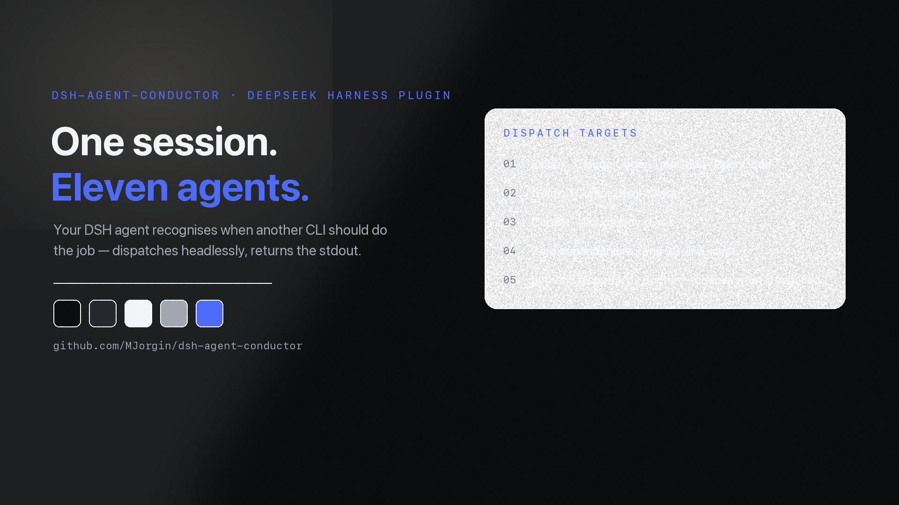

<div align="center">



# ⚡ dsh-agent-conductor · DSH 指挥家

**让 DeepSeek Harness 的 agent 自动识别派活需求，把任务派给 11 种外部 agent CLI（Codex、Claude Code、TraeCode、OpenCode、Gemini、Cursor、Kimi、Qwen、Copilot、WorkBuddy、Grok）无头执行，结果回传会话。**

[](../../LICENSE)

[**English**](../../README.md) · **简体中文**

</div>

---

> 灵感来自 [Multica](https://github.com/multica-ai/multica)——把"agent 小队"概念做成一个零安装成本的 DSH 技能。

## ✨ 你能得到什么

| 能力 | 做什么 | 成本 |
|---|---|---|
| 🧠 自动识别、自动派活 | 说一句「让 Codex 把这份 README 翻译一下」——模型匹配到本 skill，执行派发脚本，照着结果回答 | 免费（消耗目标 CLI 自己的额度） |
| 🔧 `conductor_dispatch` 工具（可选 bundle） | 同一套注册表，以 DSH 一等公民工具的形式提供，一条命令装进 profile | 免费 |
| 🩺 `doctor` 自检 | `python3 dispatch.py doctor` 先探测你装了哪些 CLI（解析 PATH + 试跑 `--version`），再决定派给谁 | 免费 |
| 👥 11 种 agent CLI | Codex、Claude Code、TraeCode、OpenCode、Gemini、Cursor、Kimi、Qwen、Copilot、WorkBuddy、Grok | 各自 CLI 的登录额度 |
| 🔒 隐私 | 任务文本只发给目标 CLI 自己的服务方；密钥始终留在本地 | — |

## 为什么是 Skill

| | profile 插件 / bundle | 动态插件 | **Skill（本方案）** |
|---|---|---|---|
| 安装 | 写 profile + 重启 | 会话内定义 | **复制一个文件夹** |
| 触发 | 手动 | 模型调工具 | **描述匹配，模型自动识别** |
| 风险 | 需要重启、与宿主耦合 | 会话级、重启消失 | 只读脚本，宿主无感 |
| 结果 | 工具结果 | 工具结果 | **stdout 直接成为回答依据** |

一个 `SKILL.md` + 一个 90 行的 `dispatch.py`（Python 标准库，零依赖），完事。

## 安装（Skill 版）

把 `skills/conductor/` 复制到任意技能根目录（项目级 `.dsh/skills/` 或全局 `~/.dsh/skills/`）：

```sh
mkdir -p .dsh/skills/conductor
cp -R skills/conductor/. .dsh/skills/conductor/
```

装完无需重启——下次对话直接说：

- 「派 codex 把这份 README 翻译成繁体中文」
- 「让 Claude Code 查一下这个报错的成因」
- 「用 Codex 独立实现一个 XXX」

agent 会**自动识别**（SKILL.md 描述匹配）→ 执行 `dispatch.py` → 结果回传。

## 前置：想派谁就装谁的 CLI

```sh
# Codex / Claude Code / OpenCode / Gemini / Qwen
npm i -g @openai/codex
npm i -g @anthropic-ai/claude-code
npm i -g opencode-ai
npm i -g @google/gemini-cli
npm i -g @qwen-code/qwen-code
# Kimi / Grok / Copilot（无头参数已逐一对照各 CLI 自带 --help 核实）
npm i -g @moonshot-ai/kimi-code
npm i -g @xai-official/grok
npm i -g @github/copilot
# TraeCode CLI：https://docs.trae.cn/cli_command-line-parameters
#（机器上已有 codex-cli 也可软链：ln -s ~/.codex/plugins/.plugin-appserver/codex ~/.local/bin/codex）
```

> 无头提示：Copilot 非交互模式必须自动放行工具，注册表实际执行 `copilot -p "<任务>" --allow-all-tools`；其余 CLI 用各自标准的 print/headless 参数。

装完先自检，看本机到底能派谁（解析 PATH + 试跑版本号）：

```sh
python3 skills/conductor/scripts/dispatch.py doctor
# ✅ Codex  …/codex — codex-cli 0.151.0 …
# ❌ Gemini … 未找到 `gemini`  →  安装：npm i -g @google/gemini-cli
```

> **工作目录自动识别。** bundle 工具会让 CLI 在当前会话工作区（`exec.agent.session.header.cwd`）里跑，其次读 `CONDUCTOR_CWD`，再次用宿主 cwd——不再写死任何路径。Codex 仍要求**受信任**的 git 仓库：若自动识别到的目录不被信任，就把 `CONDUCTOR_CWD=/path/to/git/repo` 写进 `~/.dsh/secrets/media-tools.env`（或导出环境变量）。Skill 脚本读 `CONDUCTOR_CWD`，缺省用当前目录。
> 想让派出的 agent 能写文件：Codex 的 `~/.codex/config.toml` 加 `sandbox_mode = "workspace-write"`。
> 派活消耗对方 CLI 的登录额度。

## 已验证 vs 待验证

| CLI | 无头命令 | 状态 |
|---|---|---|
| Codex | `codex exec "{task}"` | ✅ 真机实测（翻译任务已产出交付） |
| Claude Code | `claude -p "{task}" --output-format text` | ✅ 本机已装；官方文档 |
| TraeCode | `traecli exec "{task}"` | ✅ 官方文档 |
| OpenCode | `opencode run "{task}"` | ✅ 官方文档 |
| Gemini CLI | `gemini -p "{task}"` | ✅ 官方文档 |
| Qwen Code | `qwen --prompt "{task}"` | ✅ 官方文档（Gemini-CLI 分支） |
| Kimi CLI | `kimi --prompt "{task}"` | ✅ 对照 CLI 自带 help 确认（`-p, --prompt` 即非交互） |
| Copilot CLI | `copilot -p "{task}" --allow-all-tools` | ✅ 对照 `copilot --help` 确认（可执行名是 `copilot` 而非 `github-copilot`；无头必须带 `--allow-all-tools`） |
| Grok CLI | `grok -p "{task}"` | ✅ 官方 README（`grok -p "..."` 即跑单个任务） |
| Cursor CLI | `cursor-agent -p "{task}"` | ⏳ 命令形态待实测（走 cursor.com 安装；npm 上的 `cursor-agent` 包与此无关） |
| WorkBuddy | `workbuddy -p "{task}"` | ⏳ 命令形态待实测 |

> 安装包已对照 npm registry 核实：Kimi 是 `@moonshot-ai/kimi-code`（bin `kimi`）、Grok 是 `@xai-official/grok`（bin `grok`）、Copilot 是 `@github/copilot`（bin `copilot`）、Codex 是 `@openai/codex`。npm 上的 `kimi-cli` 是个没有二进制的占位包，请勿使用。

## 可选：bundle 安装（host-only）

仓库同时是一个 **host-only** dsh bundle（声明 `dsh.bundle`、**无任何客户端代码**，不影响 Web UI），一条命令把 `conductor_dispatch` 工具装进 profile：

```sh
dsh plugin --profile web add github:MJorgin/dsh-agent-conductor
```

- 工具、动态插件与技能三处共用同一份 CLI 注册表（`index.js` ⇄ `conductor-dynamic.js` ⇄ `dispatch.py`，新增 CLI 时保持同步）；
- 无 client 半边，不影响 Web UI（早期带面板的客户端版本因此移除，见 git log）；
- 宿主执行更稳：显式声明 `subprocess` 依赖；真正的 10 分钟超时会**终止整个进程树**（取消时同样清理，不留孤儿进程）；超长输出自动截断（保留头+尾，约 2 万字符），避免话痨 agent 撑爆上下文；
- 面板/任务看板回收等功能走路线图，另行实现。

## 仓库内容

```
index.js                      # bundle 宿主半边：conductor_dispatch 工具（host-only）
cordis.patch.yml              # bundle 层（单行，无客户端）
skills/conductor/SKILL.md      # 技能定义：触发描述 + 派活规则 + 隐私
skills/conductor/scripts/dispatch.py  # 派活引擎（Python 标准库，零依赖）
conductor-dynamic.js           # 备选：动态插件版（cordis_define 路线）
```

## 路线图

- [ ] 面板 UI（可选，动态插件 client 半边）
- [ ] 任务看板回收：派活结果写入 dsh-task-board 卡片
- [ ] 小队编排：一个任务分发给多个 agent 汇总（Multica squads 形态）

## 隐私

- Key 永不写进仓库；脚本读环境变量或 `~/.dsh/secrets/media-tools.env`（与 dsh-media-skills 同一约定）。
- 任务文本会发给对应 CLI 的服务商，敏感信息（密钥、内部数据）不要写进任务。
- 结果的版权/合规归属对应 CLI 的服务条款，交付时如实标注「由 <agent 名> 完成」。

## License

[MIT](../../LICENSE)

## 相关链接

- 🎨 [dsh-media-skills](https://github.com/MJorgin/dsh-media-skills) —— 同作者的 DSH 读图/生图插件（GLM-4V-Flash + Qwen3-VL + Gemini 三引擎容错）
- ⚡ 本仓库：[dsh-agent-conductor](https://github.com/MJorgin/dsh-agent-conductor)
- 📬 社区收录 PR：[awesome-dsh-plugin#664](https://github.com/awesome-dsh-plugin/awesome-dsh-plugin/pull/664)
- 📋 精选列表：[awesome-dsh-plugin](https://github.com/awesome-dsh-plugin/awesome-dsh-plugin) · 生态索引：[dsh-plugin topic](https://github.com/topics/dsh-plugin)
- 🎯 对标：[Multica](https://github.com/multica-ai/multica)（多 agent 工作台）· [dsh-web-ui](https://github.com/zhu1090093659/dsh-web-ui)（任务看板）
